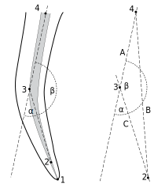

# Endodontic Measurements

## Overview
The **Endodontic Measurements** plugin is a modernized tool for ImageJ designed to semi-automate the measurement of landmarks on dental radiographs. It allows observers to locate specific sites on a tooth/root and record their coordinates and qualitative observations (like PAI scores or clinical findings) directly into a structured CSV file for further analysis.

Version 2.0 features a completely refactored Swing-based UI, improved robustness, and dynamic scaling for better visibility on various screen resolutions.

**Disclaimer:** This new version is currently undergoing active development and has not yet been thoroughly tested. Please manually verify your outputs during usage.

---

## Installation

### Quick Install (Windows)
1.  Run `install.bat` from the project root.
2.  This script will automatically:
    - Check for Maven (and use it if found).
    - Fall back to a standard Java compilation if Maven is missing.
    - Install the plugin to `C:\ImageJ\plugins`.

### Manual Install (Zip / JAR)
1. Download the provided Release zip file.
2. Extract the contents (`Endodontic_Measurements_2-2.0.0.jar` and `Endodontic_Measurements.cfg`) directly into your ImageJ `plugins` folder.
*Note: If you are building from source, you can generate the JAR by running `mvn clean package` and then copying the JAR from the `target/` directory.*

### Manual Install (No Maven)
1.  Run `compile_fallback.bat`.
    The script compiles, packages, and installs the plugin automatically.
    If `C:\ImageJ\plugins` is not found, copy `Endodontic_Measurements_2.jar` to your ImageJ plugins folder manually.

## Usage

### Setting up Measurements
1. Open a radiograph in ImageJ.
2. Launch the plugin by pressing **F5** (or via Plugins > Endodontic Measurements 2.0).
3. Select the **Point Tool** (the plugin ensures this is selected by default).
4. Identify the object by selecting the **Quadrant**, **Tooth**, **Root**, and **Image Type** in the identification panel.
5. **Note:** The measurement and observations panels are locked by default. They will automatically unlock and become available once you have fully identified the root by selecting a value for all four fields above.

### Placing Markers
- Click on the point for a landmark on the X-ray image.
- Select the corresponding site button (e.g., "Apex").
- The plugin will record the point and provide visual feedback.
- **Reference Circles**: When you place the **Apex GP** point, two circles (1mm and 4mm radius) are automatically drawn to guide you in placing the root canal diameter points.
- **Persistent markers**: After saving a root with "Save canal data", all placed markers remain visible on the image. This lets you see previously measured roots while continuing to measure additional ones on the same radiograph.

### Sites Registered

**Table 1: Sites registered**
| Site number | Description                             |
|-------------|-----------------------------------------|
| 1           | Apex                                    |
| 2           | Apex gutta-percha (AGP)                 |
| 3           | Root canal start deviation; convex aspect |
| 4           | Root canal entrance center             |
| 5           | Mesial side of root canal 1 mm from point 2 |
| 6           | Distal side of root canal 1 mm from point 2 |
| 7           | Mesial side of root canal 4 mm from point 2 |
| 8           | Distal side of root canal 4 mm from point 2 |
| 9           | Marginal bone mesial                   |
| 10          | Marginal bone distal                   |
| 11          | Cemento-enamel junction (CEJ) mesial   |
| 12          | CEJ distal                             |
| 13          | Lesion periphery                       |
| 14          | Lesion mesial                          |
| 15          | Lesion distal                          |

<table>
    <tr>
        <td></td>
        <td></td>
    </tr>
    <tr>
        <td colspan="2" style="text-align:center">Figure 1: The sites (a) and the circle to place the root canal diameter (b)</td>
    </tr>
</table>

Sites 4 and 5 are defined to obtain the Schneider angle [3] together with the AGP. The sites 4, 5 and 7, 8 are used to measure the diameter of the root canal at distances 1 and 4 mm to the AGP. The user is guided to the distances by two circles centered at the AGP (Figure 1b).

<table>
    <tr></tr>
    <tr>Figure 2: The Schneider angle (a) and the trigonometrics (b)</tr>
</table>

---

## Calculations
The coordinate data are imported to a spreadsheet for calculation of distances and angles.

**Table 2: Quantities calculated**
|Quantity to calculate |Points involved|
|-------------|-----------------------------------------|
|Schneider angle | 2, 3, 4|
|Root canal diameter | 5, 6, 7, 8|
|Distance between apex and the APG | 1, 2|
|Horizontal diameter of lesion | 14, 15|
|Vertical diameter of lesion | 1, 13|
|Bone height (attachment level) mesial | 9, 11|
|Bone height (attachment level) distal | 10, 12|

The distance between the apex and the AGP carries a sign depending on if there is a surplus (positive sign) or a deficit (negative sign) of filling material (Figure 3). The sign is automatically set in the evaluation spreadsheet by comparing the y-coordinates of points 1 and 2 together with the position of the tooth (maxilla or mandible) given by the quadrant number.

<table>
    <tr></tr>
    <tr>Figure 3: Deficit (a) and surplus (b) of filling material</tr>
</table>

### Distances
Distances $d$ are calculated from the calibrated coordinates by the Pythagorean formula:
$$d = \sqrt{(x_2 - x_1)^2 + (y_2 - y_1)^2}$$

### The Schneider angle
Figure 2b shows the sites and lines extracted from Figure 2a. A line is drawn between sites 4 and 2 to define a triangle. The distances A, B and C are defined as shown in the figure. Using the law of cosines the angle $\beta$ can be calculated using the law cosines yielding:
$$\beta = \cos^{-1}(\frac{A^2 + C^2 - B^2}{2AC})$$

The Schneider angle $\alpha$ can be obtained by the observation:
$$\alpha = 180\degree - \beta$$

---

## Qualitative Observations
In addition to the site coordinates up to 14 qualitative observations may be stored.

**Table 3: Qualitative observations stored** (NS for not scored)
|Quality | Observations|
|-------------|-----------------------------------------|
|Periapical index (PAI) | NS, 1 - 5|
|Apical voids | NS, No, Yes|
|Coronal voids | NS, No, Yes|
|Orifice plug | NS, No, Yes|
|Apical file fracture | NS, No, Yes|
|Coronal file fracture | NS, No, Yes|
|Apical perforation | NS, No, Yes|
|Coronal perforation | NS, No, Yes|
|Post | NS, No, Yes|
|Restoration gap | NS, No, Yes|
|Caries | NS, None, Dentine, Pulp space|
|Restoration | NS, None, Filling, Crown/bridge|
|Support/load | NS, Two appr, One appr, No appr, Bridge abutment|
|Comments | Free text one line|

("Two approximal supports", "One approximal support" and "No approximal support")

---

## Output and Data Storage

### 1) Measured Image Copy
The plugin creates a copy of the image with all measured sites and reference lines burnt in.
- **Filename**: `Measured-<timestamp>-<original_filename>.tif`

### 2) Result File (CSV)
Measurements are appended to a CSV file. Version 2.0 exports data using the following exact ordered format:
`filepath, timestamp, operator, image type, unit, quadrant, tooth, root, PAI, Ap voids, Cor voids, Orifice plug, Ap file fract, Cor file fract, Ap perf, Cor perf, Post, Restoration gap, Caries, Restoration, Support/load, [Site Coordinates x/y]..., Comment`

- **Local Storage**: Results are saved as `<original_filename>.csv` in the same folder as the image.
- **Global Storage**: Results are saved to `Measurements.csv` in the directory **above** the image directory.

---

## Configuration
The plugin looks for `Endodontic_Measurements.cfg` in the following locations:
1. The ImageJ `plugins/` directory (Recommended for manually dragged JARs).
2. The `ImageJ/plugins/Endodontic_Measurements_2.0/` directory.
3. The local directory where the plugin is running.

**Config Options:**
- `operator`: <Your Name/ID>
- `decimal-separator`: `.` or `,`
- `measurement_store`: `top` (global) or `local`
- `save_scored_image_copy`: `true` or `false`

---

---

## References
1. Jordal, Kristin; Skudutyte-Rysstad, Rasa; Sen, Abhijit; Torgersen, Gerald; Ørstavik, Dag & Sunde, Pia Titterud (2021). Effects of an individualized training course on technical quality and periapical status of teeth treated endodontically by dentists in the Public Dental Service in Norway. An observational intervention study. International Endodontic Journal. ISSN 0143-2885. doi: [10.1111/iej.13669](https://doi.org/10.1111/iej.13669).
2. Preus et al. (2015). A new digital tool for radiographic bone level measurements in longitudinal studies. BMC Oral Health. ISSN 1472-6831. 15(1), s. 1–7. doi: [10.1186/s12903-015-0092-9](https://doi.org/10.1186/s12903-015-0092-9).
3. Schneider SW. A comparison of canal preparations in straight and curved root canals. Oral Surg Oral Med Oral Pathol 1971;32(2):271-5.

---

## License
Endodontic Measurements plugin is distributed under the **Creative Commons Attribution 4.0 International Public License**.
Copyright (C) 2024-2026 Gerald Torgersen.
